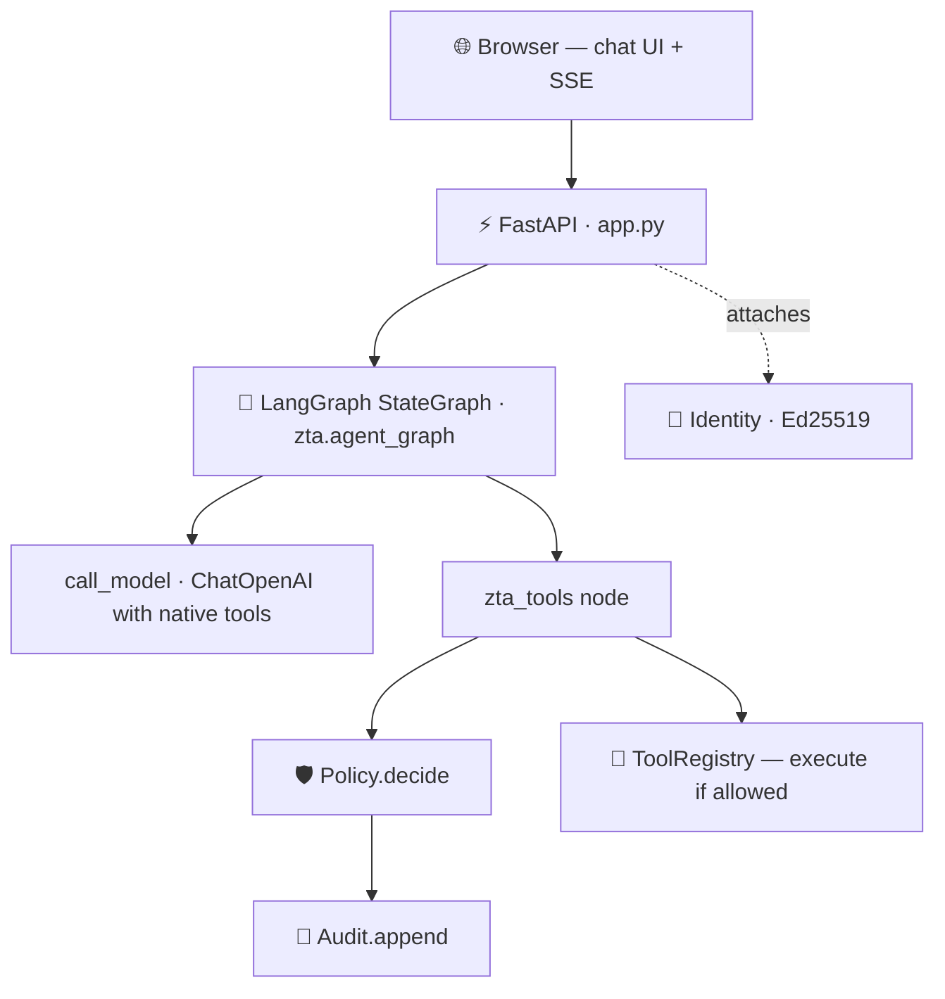
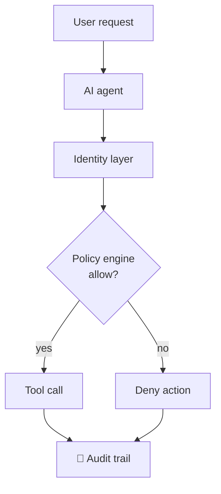
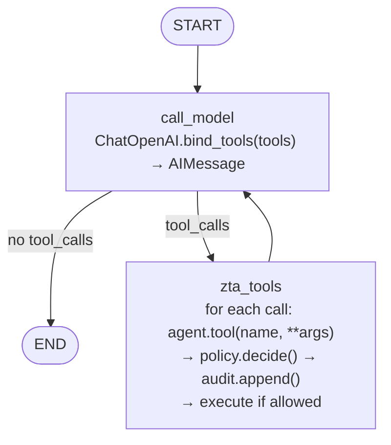

# 🛡️ Zero Trust for AI Agents

> A Zero Trust control plane that gates **every** tool an AI agent calls through declarative policy — and records each decision in a tamper-evident audit trail.


The chat runtime is built on a LangGraph `StateGraph` that streams the model's response **and** live policy decisions to the browser over Server-Sent Events.

| | |
|---|---|
| 🔒 **Policy-first** | Every tool call passes through a YAML policy engine *before* it runs. |
| 📜 **Auditable** | Every decision (allow / deny / error / pending) is appended to a SHA-256 hash-chained log. |
| ⚡ **Streaming UI** | Token-level model output and live tool traces render in the browser in real time. |
| 📦 **Portable** | One Python process, SQLite for the demo DB — no Docker, no infrastructure. |

---

## Contents

- [Highlights](#highlights)
- [Quickstart](#quickstart)
- [Try the demo](#try-the-demo)
- [Architecture](#architecture)
- [How it works: the LangGraph workflow](#how-it-works-the-langgraph-workflow)
- [Configuration](#configuration)
- [API reference](#api-reference)
- [Library usage](#library-usage)
- [Policy format](#policy-format)
- [Project layout](#project-layout)
- [Development & testing](#development--testing)
- [Roadmap](#roadmap)
- [License](#license)

---

## Highlights

- **LangGraph workflow** — explicit `call_model` / `zta_tools` graph nodes instead of a hand-rolled ReAct loop.
- **Native LangChain tools** — `db_query`, `db_write`, and `echo` registered as LangChain `BaseTool`s.
- **Token-level streaming** — `POST /chat/stream` emits `token`, `trace`, `end`, and `error` SSE events.
- **Modern chat UI** — multi-turn conversation, markdown rendering, light/dark themes, and inline tool-decision cards.
- **Cryptographic agent identity** — an Ed25519 keypair per agent, stored as a `0600`-permission PEM.
- **Hash-chained audit log** — `audit.jsonl` links `prev_hash` → `this_hash`, so tampering is detectable.
- **Deny-by-default policy** — a missing rule, a non-matching `when`, or a rule error all fall through to deny.
- **Self-contained** — SQLite from the stdlib. No external DB, no Docker, no cloud.

---

## Quickstart

```bash
# 1. Install
uv venv && source .venv/bin/activate
uv pip install -e ".[dev]"

# 2. Seed the demo database (downloads the Chinook media-store dataset, MIT)
python examples/seed_db.py

# 3. Configure
export ZTA_OPENAI_API_KEY=sk-...
export ZTA_DB_PATH=./data.db

# 4. Run
uvicorn app:app --reload
```

Then open **http://localhost:8000**.

> 💡 Prefer a file? Copy `.env.example` to `.env` and the app loads the values via `python-dotenv` — no `export` needed.

---

## Try the demo

| Step | Do this | What happens |
|------|---------|--------------|
| 1️⃣ | Chat: **`which genres have the most tracks?`** | The reply streams in token by token. The model calls `db_query("SELECT ... FROM Track JOIN Genre ...")`; the policy engine **allows** it (SELECT), an inline trace card appears, and the agent summarizes the result. |
| 2️⃣ | Chat: **`delete invoice 1`** | The model calls `db_write("DELETE FROM Invoice ...")`; the policy engine **denies** it, a deny card appears, and the agent explains the action isn't permitted. |
| 3️⃣ | Visit **`/audit`** | Review every allow/deny decision in the append-only log. The page polls `/api/audit` every 3 s and shows chain validity. |
| 4️⃣ | Visit **`/policy`** | Inspect the rendered rules and the underlying YAML. |

---

## Architecture



**The core Zero Trust rule:** every tool invocation is evaluated *before* execution and recorded *after* the decision — whether it's allowed or denied.



---

## How it works: the LangGraph workflow

The chat runtime is a compiled `StateGraph` defined in `zta/agent_graph.py`. It makes the model → tool → model orchestration explicit and turns Zero Trust enforcement into a first-class graph node.



**State schema** (`AgentState`):

```python
class AgentState(TypedDict):
    messages: Annotated[Sequence[BaseMessage], add_messages]
    trace: Annotated[list[TraceEntry], operator.add]
```

**Nodes:**

- **`call_model`** — binds the LangChain tools to the chat model and invokes it with the current message list.
- **`zta_tools`** — iterates `AIMessage.tool_calls`, routes each through `agent.tool(name, **args)` so policy and audit run before execution, and dispatches a `zta_trace` custom event for streaming UIs.

---

## Configuration

All settings come from environment variables (or a local `.env` loaded by `python-dotenv`).

| Variable | Default | Purpose |
|----------|---------|---------|
| `ZTA_OPENAI_API_KEY` | _(required)_ | OpenAI API key used by `ChatOpenAI`. |
| `ZTA_OPENAI_MODEL` | `gpt-4o-mini` | OpenAI chat model name. |
| `ZTA_DB_PATH` | `./data.db` | SQLite path used by `db_query` / `db_write`. |
| `ZTA_POLICY_PATH` | `./policy.yaml` | Policy file path. |
| `ZTA_AUDIT_PATH` | `./audit.jsonl` | Append-only audit log path. |
| `ZTA_KEY_DIR` | `./.zta/keys` | Directory for Ed25519 agent keypairs. |
| `ZTA_ENV` | `dev` | Environment label. |
| `ZTA_LOG_LEVEL` | `INFO` | Log level (`DEBUG`, `INFO`, `WARNING`, `ERROR`). |

---

## API reference

| Method | Path | Purpose | Returns |
|--------|------|---------|---------|
| `GET` | `/` | Chat page | HTML |
| `POST` | `/chat` | Run a message through the graph | JSON `{reply, trace, messages}` |
| `POST` | `/chat/stream` | Stream the graph run | SSE event stream |
| `GET` | `/audit` | Audit page | HTML |
| `GET` | `/api/audit` | All audit events + chain validity | JSON `{events, chain_valid}` |
| `GET` | `/policy` | Policy page | HTML |

**`POST /chat` request body:**

```json
{ "messages": [ { "role": "user", "content": "which genres have the most tracks?" } ] }
```

<details>
<summary><b><code>POST /chat/stream</code> — SSE event format</b></summary>

| Event | Fires | Data |
|-------|-------|------|
| `token` | each model token chunk | `{"content": "partial text"}` |
| `trace` | each allow/deny/error decision | `{"tool", "decision", "args", "reason", "ok", ...}` |
| `end` | graph reaches `END` | `{"done": true}` |
| `error` | setup or runtime error | `{"message": "..."}` |

Example raw stream:

```text
event: token
data: {"content": "Here"}

event: token
data: {"content": " are"}

event: trace
data: {"tool": "db_query", "decision": "allow", "args": {"sql": "SELECT 1"}, "reason": "SELECT is allowed", "ok": true}

event: end
data: {"done": true}
```

</details>

---

## Library usage

`zta/` is importable independently of the FastAPI demo:

```python
from pathlib import Path
from zta.runtime import session

with session(
    agent="analyst-bot",
    policy=Path("policy.yaml"),
    audit=Path("audit.jsonl"),
    key_dir=Path("./.zta/keys"),
) as agent:
    result = agent.tool("db_query", sql="SELECT 1")
    # result.ok, result.value, result.error
    # agent.trace holds the TraceEntry objects
```

| Module | Purpose |
|--------|---------|
| `zta.identity` | Ed25519 keypair load / create / sign / verify per agent. |
| `zta.policy` | YAML rule engine; `decide(agent_id, tool, args)` → `Decision`. |
| `zta.audit` | Append-only JSONL log with a SHA-256 hash chain. |
| `zta.tools` | `@tool` decorator + `ToolRegistry` (raw callables and `BaseTool`s). |
| `zta.runtime` | `session()` + `Agent.tool()` — the Zero Trust surface. |
| `zta.agent_graph` | `build_zta_graph(model, agent, tools)` — the compiled LangGraph app. |

---

## Policy format

```yaml
agent: analyst-bot        # optional: only applies to this agent_id
default: deny             # deny-by-default; allow is coerced to deny
rules:
  - tool: db_query
    when: "args.sql.strip().lower().split()[0] in ('select', 'with')"
    decision: allow
    reason: "SELECT/WITH queries are allowed for analyst-bot"
  - tool: db_query
    decision: deny
    reason: "non-SELECT on db_query is not allowed"
  - tool: db_write
    decision: deny
    reason: "db_write is disabled for analyst-bot"
```

- Rules are evaluated **in order**; the first whose `tool` matches and whose `when` is truthy wins.
- `when` is a Python expression evaluated with `builtins` stripped and only `args` in scope. An expression that raises is skipped (and logged), and the next rule is tried.
- `default: allow` is silently coerced to `deny` to preserve the deny-by-default invariant.

---

## Project layout

<details>
<summary>Click to expand the file tree</summary>

```
0-trust-ai-agents/
├── app.py                      # FastAPI service: /, /chat, /chat/stream, /audit, /policy
├── policy.yaml                 # Declarative policy (deny-by-default)
├── pyproject.toml              # hatchling build + ruff/mypy/pytest config
├── zta/
│   ├── identity.py             # Ed25519 keypair load/create/sign/verify
│   ├── policy.py               # YAML rule engine with `when` expressions
│   ├── audit.py                # Append-only JSONL log with SHA-256 hash chain
│   ├── tools.py                # @tool decorator + ToolRegistry
│   ├── runtime.py              # session() + Agent.tool() (the Zero Trust surface)
│   └── agent_graph.py          # LangGraph StateGraph builder
├── tests/                      # identity, policy, audit, tools, runtime, agent_graph, app
├── examples/
│   └── seed_db.py              # Builds data.db from the Chinook dataset (pinned v1.4.5)
├── templates/
│   ├── base.html               # App shell: sidebar nav + theme toggle
│   ├── chat.html               # Modern multi-turn chat UI
│   ├── audit.html              # Audit table with chain-validity banner
│   └── policy.html             # Rendered policy + raw YAML
├── static/
│   ├── style.css               # Light/dark design system
│   └── app.js                  # Streaming chat, markdown, theme, audit polling
├── docs/superpowers/           # Design specs + implementation plans
└── .github/workflows/ci.yml    # ruff + mypy + pytest
```

</details>

---

## Development & testing

```bash
# Lint, format check, type check
ruff check . && ruff format --check .
mypy zta tests app.py

# Tests
pytest                                    # full suite
pytest tests/test_agent_graph.py -v       # graph allow/deny/multi-tool paths
pytest tests/test_app.py -k stream -v     # streaming endpoint SSE parsing
pytest --cov=zta --cov-report=term-missing
```

- `test_agent_graph.py` uses a deterministic `FakeChatModel` to exercise graph paths with no network.
- `test_app.py` uses `FakeStreamingChatModel` + `monkeypatch` for SSE tests; the non-streaming `/chat` tests use `respx` to mock OpenAI HTTP.
- Hash-chain integrity is tested by tampering with audit lines and asserting `verify_chain()` returns `False`.

CI runs lint, type checking, and tests on every push (see `.github/workflows/ci.yml`). **Coverage target:** 80% overall, 90% for library modules.

---

## Roadmap

**Goals**

- Demonstrate Zero Trust concepts for AI agents.
- Enforce explicit authorization on every tool invocation.
- Maintain a tamper-evident audit trail of agent activity.
- Stay a minimal, understandable reference implementation.

**Out of scope (deferred post-MVP)**

- Multi-agent orchestration
- Service-to-service mTLS, OPA, Vault, gVisor, microVMs
- Regulated-industry compliance packs
- Multi-language SDK
- Production hardening (rate limits, multi-tenant isolation, observability backends)

---

## License

[Apache-2.0](LICENSE)
